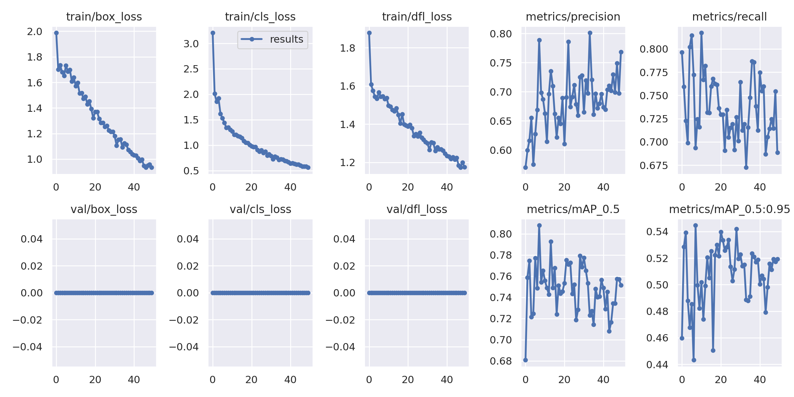
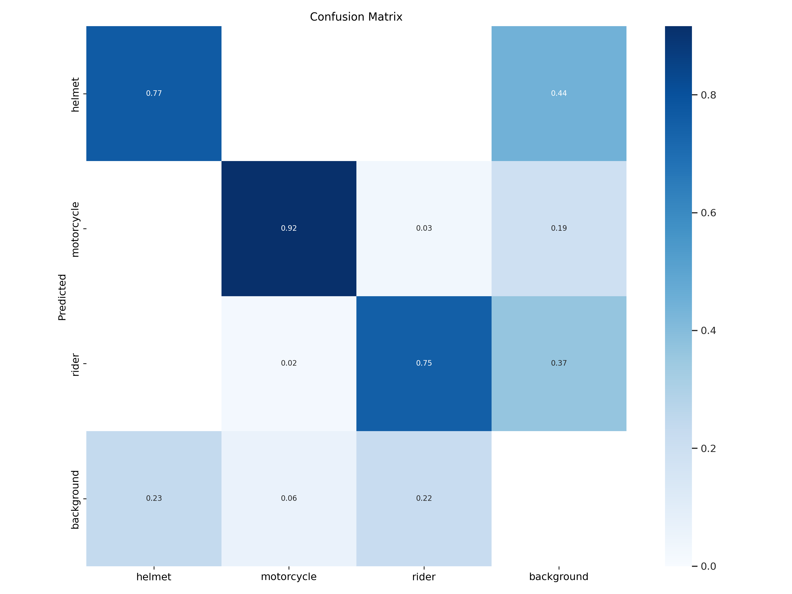

# 🛵 High-Density Traffic Helmet Detection & Tracking 

This repository contains an end-to-end Machine Learning pipeline designed to detect and track motorcycle riders and monitor safety gear (helmet) compliance. 

Built specifically for high-density, "lane-filtering" traffic scenarios common in the Philippines, the system leverages **YOLOv9** for state-of-the-art object detection and **Deep SORT** (Simple Online and Realtime Tracking) to maintain consistent identification even during complex urban maneuvers and temporary occlusions.

## 📊 Project Output
<video src="https://github.com/user-attachments/assets/decf72d9-ea89-4482-8dbe-2073850e03bb" autoplay loop muted playsinline width="100%"></video>

> *Demonstration of the system maintaining tracking IDs (Deep SORT) across a high-density traffic flow.*

## 🛠️ The ML Lifecycle & Pipeline
This project follows a structured Data Science workflow to ensure model robustness and tracking accuracy:

1. **Pre-processing & Annotation:** Utilized **Roboflow** for dataset management, handling image augmentation and manual annotation of `Motorcycle`, `Rider`, and `Helmet` classes.
2. **Model Training:** Employed **YOLOv9** to leverage its Programmable Gradient Information (PGI) for improved feature extraction on small targets (helmets).
3. **Tracking Integration:** Integrated **Deep SORT** to assign and maintain unique IDs across frames. 
4. **Hyperparameter Tuning:** Fine-tuned tracking parameters specifically for local traffic behavior.
   * `max_age=50`: To keep tracks alive during frequent occlusions (lane filtering).
   * `lr=0.01`: Initial Learning Rate.
   * `epochs=50`: Total Training Iterations
   * `batch=8`: Batch size for training

## 📈 Model Evaluation
The model was trained for 50 epochs and developed locally on an i7-10750H CPU and RTX 2060 GPU hardware environment for draft but on the final run, google collab was utilized.

| Training Metrics | Confusion Matrix |
| :---: | :---: |
|  |  |
| *Steady convergence across classification and box loss functions.* | *92% accuracy in motorcycle identification.* |

### Key Technical Insights:
* **High Precision Detection:** The model achieves a **0.92** True Positive rate for motorcycles.
* **Safety Gear Monitoring:** Successfully identifies helmets at a **0.77** rate, providing a solid foundation for compliance monitoring.
* **Data Limitation Addressed:** The confusion matrix reveals a 44% background interference rate for helmets. In heavy urban traffic, circular background objects (like side mirrors or top boxes) occasionally trigger false positives. Future iterations will utilize a "negative sample" dataset to penalize these specific background shapes.

## 🔬 Research & Development
The full development process, including data handling, YOLOv9 integration, and the Deep SORT tracking logic, is documented in the central Jupyter Notebook. 

👉 **[View the Core Implementation Notebook](notebooks/Hyperparameter-1-Helmet-Detection-Using-YoloV9+DeepSort_Cleared_Output.ipynb)**

## 👤 Author

Developed as a computer vision project demonstrating applied deep learning for real-world safety scenarios.
